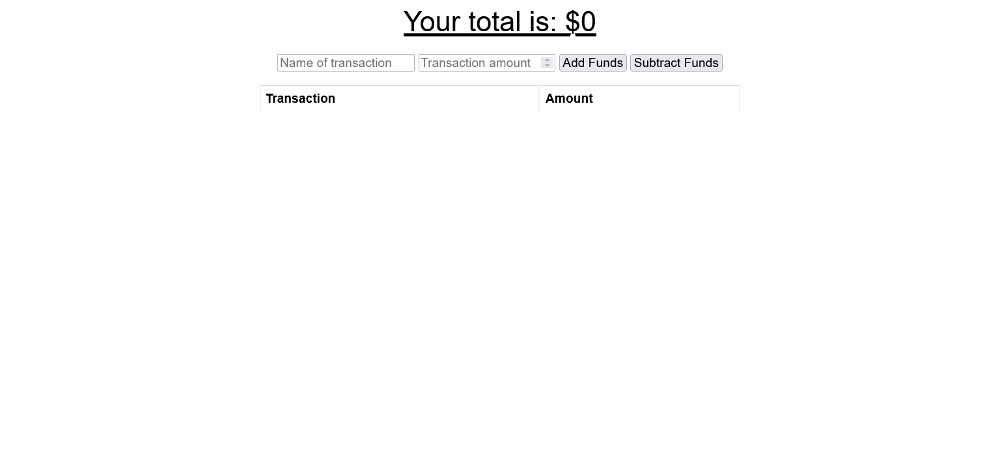

# budget-tracker

## Description
A progressive web application that allows the user to track their budget. Due to an unknown bug, the application currently only works on localhost, and the deployed version on Heroku has mysterious errors that after hours of bugfixing I couldn't fix. Feel free to let me know if you have any advice.

* [Github Source Repository](https://github.com/byampols/budget-tracker).
* [Deployed Application](https://powerful-brushlands-97175.herokuapp.com/)

## Table of Contents
1. [Usage](#usage)
2. [License](#license)
3. [Contributors](#contributors)
4. [Questions](#questions)

## Ideal Usage (if it functioned)

* Enter a name and a value, then add or subtract the value.
* As a progressive web application, if you go offline, your inputs should save and be added when the internet reconnects.

## License

[MIT License](https://opensource.org/licenses/MIT).

## Contributors
* [Ben Yampolsky](github.com/byampols)
* [Initial Source Code](https://github.com/coding-boot-camp/symmetrical-bassoon)
* [Express](https://expressjs.com/)
* [MongoDB](https://www.mongodb.com/)
* [Mongoose](https://mongoosejs.com/docs/)
* [validateEmail](https://stackoverflow.com/a/24214767)

## Questions
### [My github profile.](https://github.com/byampols)
### [Email me if you have any questions or advice!](byampols@alumni.cmu.edu)